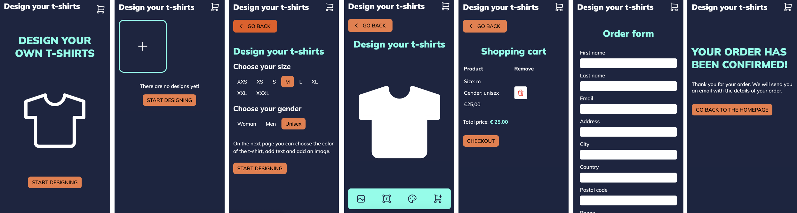

# Design your t-shirt

Design you t-shirt is een website waar je een t-shirt kan ontwerpen. Je kan uit verschillende kleuren kiezen en ook verschillende teksten en afbeeldingen toevoegen. Wanneer je een ontwerp hebt gemaakt wordt deze opgeslagen in local storage. Hierdoor kun je meerdere ontwerpen maken en uiteindelijk bestellen.

Deze website heb ik gemaakt voor het vak Browser Technologies gedurende de minor Web-Design en Development aan de Hogeschool van Amsterdam.

Je kunt de demo van mijn website [hier](https://inevdhoven.github.io/browser-technologies-2223/) vinden.



## Table of Contents

## Hoe kun je de website installeren?

Je kan dit project clonen met de volgende commando's in je terminal in de map waar je het project wilt hebben in te voeren:

` git clone https://github.com/Inevdhoven/browser-technologies-2223.git`

Hierna kun je de website openen in je browser door de index.html te klikken. Ook kun je het project openen in je code editor en de code bekijken of er aanpassingen aan maken.

## De features

In deze website zitten de volgende features:

- De gebruiker kan de maat van het t-shirt kiezen
- De gebruiker kan kiezen of het t-shirt voor een vrouw, man of unisex is
- De gebruiker kan een t-shirt ontwerpen, hierbij kan de gebruiker kiezen om een afbeelding en tekst op het t-shirt te plaatsen.
- De gebruiker kan de kleur van het t-shirt aanpassen
- Wanneer de gebruiker een ontwerp heeft gemaakt wordt deze opgeslagen in local storage
- De gebruiker kan meerdere ontwerpen maken en deze worden in local storage opgeslagen
- De gebruiker kan de ontwerpen terug zien in een overzicht
- De gebruiker kan de gemaakten ontwerpen in de winkelwagen terug vinden en naar het bestelproces gaan

### De core feature

De core feature van deze website is het ontwerpen van een t-shirt. De gebruiker kan kiezen uit verschillende kleuren, teksten en afbeeldingen. Ook kan de gebruiker de maat van het t-shirt kiezen en de kleur van het t-shirt aanpassen. Wanneer de gebruiker een ontwerp heeft gemaakt wordt deze opgeslagen in local storage. De gebruiker kan meerdere ontwerpen maken en deze worden in local storage opgeslagen. De gebruiker kan de ontwerpen terug zien in een overzicht. De gebruiker kan de gemaakten ontwerpen in de winkelwagen terug vinden en naar het bestelproces gaan.

## Hoe heb ik progressive enhancement toegepast?

Ik heb progressive enhancement toegepast door eerst te beginnen met het opzetten van de HTML, zonder CSS en JavaScript. Vervolgens heb ik de CSS toegevoegd en daarna de JavaScript. Hierdoor heb ik ervoor gezorgd dat de website ook zonder CSS en JavaScript werkt. De gebruiker kan dan nog steeds door de website navigeren. Op deze manier wordt er alleen niks opgeslagen, dit zou dan serverside gedaan moeten worden.

De progressive enhancement kun je ook zien in de vallidation van de input velden in het order formulier. Wanneer de gebruiker een verkeerde input geeft wordt er een error message getoond. Deze error message wordt getoond door JavaScript. Wanneer JavaScript uit staat wordt er een error message getoond door de HTML5 validatie.

Wanneer de gebruiker bijvoorbeeld het laten zien van de afbeeldingen uitzet. Dan krijgt de gebruiker waar de afbeeldingen stonden de alt tekst te zien met daarin wat er zou moeten staan. Op deze manier kan de gebruiker nog steeds de website gebruiken.

## Hoe heb ik feature detection toegepast?

Featrure detection is een manier om te kijken of de browser de feature die je hebt toegepast ondersteunt of niet. Ik heb feature detection toegepast door te kijken of de browser bijvoorbeeld local storage ondersteunt. Als er geen local storage wordt ondersteund, zal het opslaan van de ontwerpen serverside moeten worden opgelost.

Ik heb ook feature detection gebruikt om te kijken wat voor CSS features er wel en niet worden gesupport. Zo ben ik er bijvoorbeeld achter gekomen dat appearance: none niet in Flow wordt ondersteund. Dit heb ik opgelost door wanneer appearance: none niet wordt ondersteund, opacity: 0 te gebruiken. Dit heb ik ook gedaan voor de selector :has() en de property cursor: pointer.

## Wat moet er serverside worden opgelost?

Wanneer JavaScript uit wordt gezet of wanneer de browser geen local storage ondersteund, moet het opslaan van de ontwerpen serverside worden opgelost. Dit zou bijvoorbeeld kunnen door de ontwerpen in een Express session, doormiddel van Cookies of in een database op te slaan. Voor dit project heb ik geen backend toegevoegd, maar ik ga wel uitleggen wat er serverside zou moeten worden opgelost.

### Het opslaan van de ontwerpen

Om de backend van het project te regelen moet je eerst Nodejs en NPM installeren. Vervolgens heb je een aantal npm packages nodig. Deze packages zijn:

- Express.js
- Express-session
- Template engine (bijvoorbeeld Handlebars of EJS)
- MongoDB voor de Database
- Crypto voor het maken van random id's

#### De stappen om het serverside te maken

1. Installeer Nodejs en NPM
2. Maak een nieuwe map aan voor het project
3. Maak een package.json aan met de commando `npm init`
4. Installeer Express.js met de commando `npm install express`
5. Maak een server aan met Express.js
6. Installeer de middelware voor Express.js
7. Kies een template engine en installeer deze
8. Maak de server aan. De server moet de volgende routes hebben:
   - **/** (de homepage)
   - **/overview** (de pagina waar de gebruiker al zijn/haar ontwerpen kan zien)
   - **/choose-size** (de pagina waar de gebruiker de maat en de pasvorm (vrouw, man of unisex) van het t-shirt kan kiezen)
   - **/design** (de pagina waar de gebruiker een t-shirt kan ontwerpen)
   - **/shopping-cart** (de pagina waar de gebruiker de ontwerpen kan zien die hij/zij in de winkelwagen heeft)
   - **/order-form** (de pagina waar de gebruiker het order formulier kan invullen)
   - **/order-confirmation** (de pagina waar de gebruiker de order succesvol heeft geplaatst)
9. Maak een database aan en installeer de npm package voor de database

#### Data opslaan in de server

Nu we alles wat we nodig hebben hebben staan kunnen we aan de slag gaan met het opslaan van de verschillende onderdelen. Eerst is het de bedoeling dat we een id gaan aanmaken voor elke nieuwe order die wordt aangemaakt, op deze manier kunnen we namelijk de data die bij de juiste order hoort opslaan. Om dit te doen moet er voor elke nieuw ontwerp een orderid worden aangemaakt. Dit orderid moet dan ook in de link geplaatst worden, zodat de ook precies kan zien welke order hij/zij aan het bekijken is. Dit kan bijvoorbeeld door de volgende code te gebruiken:

` Install npm install crypto`

`const crypto = require('crypto');`

`const id = crypto.randomBytes(16).toString('hex');`

`console.log(id);`

Nu staat er in de console een random id. Dit id kan je dan in de link plaatsen. Om het id te gebruiken in de link moet je de volgende code gebruiken:

`<a href="/design/${id}">`

Nu kun je met het id data opslaan voor die specifieke order of data ophalen van de specifieke order. Dit wil je of opslaan in een database of in een object in de server.

Om ingevulde data op te kunnen halen en op te slaan moet er om alle input velden een formulier gezet worden zodat er met post data uit het formulier gehaald kan worden.

```
<form action="/shoppingcart.html" method="POST"> Hier de input velden</form>
```

Om de data uit het formulier te halen moet je de volgende code gebruiken:

```
app.post('/shoppingcart.html', (req, res) => {
    const data = req.body;
    console.log(data);
    res.redirect('/shoppingcart.html');
});
```

Om ervoor te zorgen dat de data wordt opgeslagen voor wanneer de gebruiker een pagina ververst of terug gaat naar een al eerder ingevulde pagina, moet deze data opgeslagen worden. Hiervoor kun je express session gebruiken.

## De browsers waarin ik heb getest

De browsers waarin ik heb getest op desktop zijn:

- Chrome
- Firefox
- Safari
- Flow

De browsers waarin ik heb getest op mobiel zijn:

- Safari (iOS)
- Samsung Internet (Android)

## Testverslag

Nadat ik bijna klaar was met het maken van de website heb ik de website getest in de verschillende browsers. Hieronder kun je lezen wat ik allemaal ben tegen gekomen per browser. Onder het testen ben ik de hele website doorlopen en heb ik gekeken of alles werkte. Ook heb ik de website getest in de volgende combinaties:

- Met HTML en CSS aan
- Met HTML en JavaScript aan
- Met HTML, CSS en JavaScript aan

Deze tests heb ik gedaan in de volgende browsers, met daarbij mijn bevindingen:

### Chrome

In Chrome ben ik bijna niets tegen gekomen, omdat dit de browser is waarin ik werk. Hierdoor weet ik van de HTML en CSS die ik gebruik wat wel en niet werkt. Daarnaast word veel van de CSS die ik gebruik ondersteund door Chrome. Op het gebied van JavaScript heb ik tot nu toe ook geen problemen ondervonden.

### Firefox

In Firefox ben ik maar een probleem tegen gekomen en dat is dat niet alle CSS die ik heb gebruikt al wordt ondersteund. Op mobiel formaat is mijn website bijvoorbeeld niet bruikbaar doordat ik gebruik maak van de selector :has(). Dit ga ik oplossen door het op een andere manier te stylen. Verder werkt alle HTML, CSS en JavaScript in Firefox.

### Safari

In Safari op desktop ben ik maar een probleempje tegen gekomen en dat in de navigatiebalk de padding niet helemaal goed ging. Dit heb ik opgelost door specifiek alleen voor Safari de padding aan te passen. Verder werkt alle HTML, CSS en JavaScript in Safari.

### Flow

In Flow liep ik tegen meer problemen op dan in de andere browsers. De meeste problemen kwam ik tegen op het gebied van CSS en JavaScript. Zo kwam ik er al snel achter dat de JavaScript die ik gebruik in Flow niet werkt. Dit komt waarschijnlijk doordat Flow localstorage niet ondersteund. Hierdoor werkt het ontwerpen van de t-shirts net als wanneer je JavaScript uit zou zetten en worden de ontwerpen dus niet opgeslagen. Hiervoor ga ik een omschrijving maken wat er serverside moet worden gedaan om dit op te lossen.

Verder ben ik ook veel tegen gekomen op het gebied van CSS. Zo werken de porperties appearance: none en cursor: pointer niet in Flow. Voor de property appearance: none heb ik een oplossing gevonden door opacity: 0 te gebruiken. Voor de property cursor: pointer heb ik een oplossing gevonden door de cursor: pointer alleen te gebruiken wanneer de browser de property ondersteund. Dan werkt ook de selector :has() niet in Flow. Dit ga ik op een andere manier oplossen door andere selectors en styling te gebruiken wanneer :has() niet wordt ondersteund.

Dan kwam ik nog een rare bug tegen waar ik nog geen oplossing voor heb gevonden en dat is dat wanneer je in een input veld tekst typt, alle velden zich gaan verplaatsen. Als ik nog tijd heb ga ik hier nog verder naar kijken. Maar omdat dit alleen het geval is in Flow en niet in de andere browsers, heb ik dit niet als prioriteit gezet.

Als laatste ben ik er nog achter gekomen dat required op input velden niet werkt in Flow. Ik ga nog kijken of ik dit kan oplossen door met JavaScript te checken of de input velden zijn ingevuld.

### Safari (iOS)

In Safari op iOS ben ik maar een paar kleine problemen tegen gekomen. De eerste was dat het t-shirt dat de gebruiker aan het ontwerpen is over de navigatiebalk met de knoppen om de afbeelding, tekst en kleur toe te voegen of aan te passen heen viel. Dit heb ik opgelost door aan het t-shirt een z-index te geven zodat deze er achter komt te liggen. Verder werkt alle HTML, CSS en JavaScript in Safari iOS.

### Samsung Internet (Android)

Bij het testen op Samsung Internet kwam ik erachter dat net als op de mobiele versie van Safari, het t-shirt over de navigatiebalk heen viel. Dit heb ik opgelost door aan het t-shirt een z-index te geven zodat deze er achter komt te liggen. Verder werkt alle HTML, CSS en JavaScript in Samsung Internet.

### Contrast check

Met de extentie van WCAG Contrast Checker heb ik gekeken of de kleuren die ik heb gebruikt voldoen aan de WCAG 2.0 AA norm.

Door het checken van de kleuren kwam ik erachter dat witte tekst op een oranje achtergrond niet voldoet aan de norm. Dit heb ik opgelost door de kleur van de tekst aan te passen naar zwart. Verder voldoen alle andere kleuren aan de norm.

### Screenreader test

Ik heb de website getest met de screenreader van VoiceOver op macOS. Hieronder kun je lezen wat ik allemaal ben tegen gekomen.

In de navigatie kwam ik erachter dat er wel werd gezegd dat er een link Design your t-shirts is, maar er werd niet gezegd waar deze link naar toe gaat. Dit heb ik opgelost door na de h1 nog een span met de tekst go to homepage te plaatsen. Hierdoor wordt er nu wel gezegd waar de link naar toe gaat.

Op de homepage heb ik ook een afbeelding dit is een SVG waar je geen alt tekst op kan zetten waardoor er nu alleen afbeelding werd gezegd. Dit heb ik opgelost door aan de SVG een title toe te voegen met de tekst t-shirt. Nu word er t-shirt afbeelding gezegd. Wat duidelijker is.

Op de overview pagina waar je de t-shirts die je al hebt ontworpen terug kan vinden, kwam ik erachter dat er hier bij een afbeelding die je hebt geupload werd object object werd gezegd. Dit heb ik opgelost door inplaats van order, orderId te gebruiken. Nu word er uploaded image of en dan het order id gezegd.

Op de pagina waar je het t-shirt kan ontwerpen, kwam ik erachter dat de knop upload image niet met tab te bereiken is.

## TO DO:

| TO DO                                             | STATUS             |
| ------------------------------------------------- | ------------------ |
| Bedenken hoe de website er uit moet komen te zien | :white_check_mark: |
| HTML schrijven                                    | :white_check_mark: |
| CSS schrijven                                     | :white_check_mark: |
| JavaScript schrijven                              | :white_check_mark: |
| JavaScript Validatie toevoegen                    | :white_check_mark: |
| Responsive maken                                  | :white_check_mark: |
| Testen Chrome                                     | :white_check_mark: |
| Testen Firefox                                    | :white_check_mark: |
| Testen Safari                                     | :white_check_mark: |
| Testen Flow                                       | :white_check_mark: |
| Testen Safari (iOS)                               | :white_check_mark: |
| Testen Samsung Internet (Android)                 | :white_check_mark: |
| Contrast check                                    | :white_check_mark: |
| Screenreader test                                 | :white_check_mark: |
| Readme schrijven                                  | :white_check_mark: |
| Serverside uitleg schrijven                       | :white_check_mark: |
| GitHub Pages localsotrage fixen                   |                    |
| Tekst kleur ook kunnen laten aanpassen            |                    |
| :has() mobiel Firefox en Flow oplossen            |                    |

## Bronnen

Kijk voor de bronnen in mijn [Notion](https://smooth-freeze-4ae.notion.site/Browser-Technologies-c007bb643c594744963b512dc8793039) bestand.
